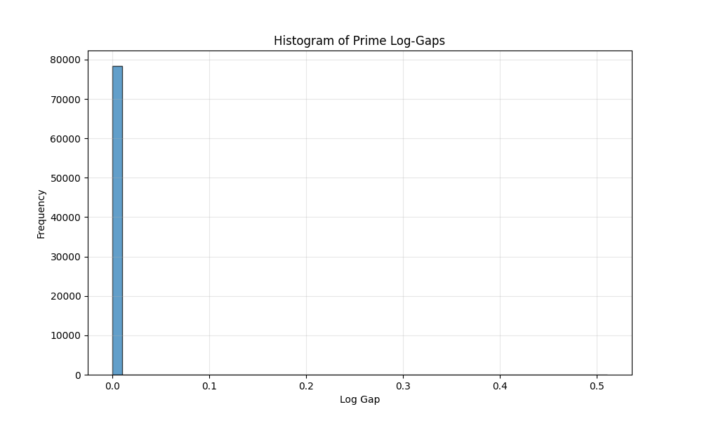
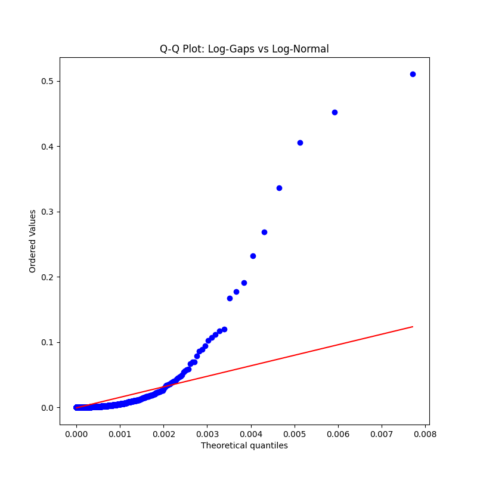
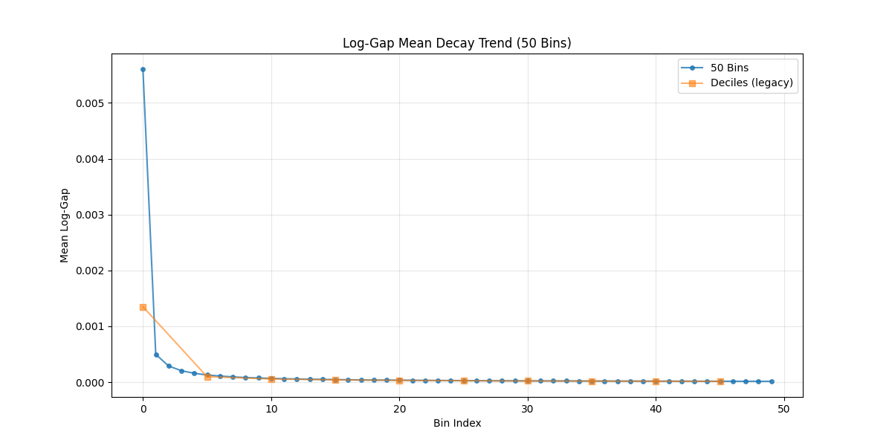
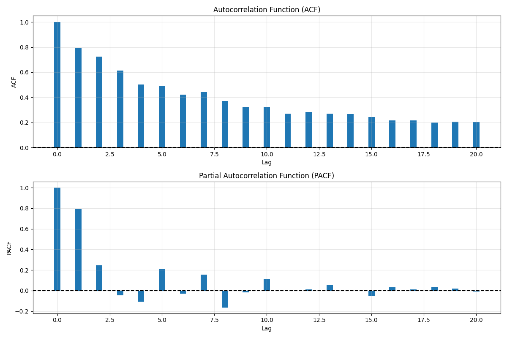

# Plots: Prime Log-Gap Falsification Experiment

This document describes the generated plots for the prime log-gap analysis at the 10^6 scale.

## Log Gap Histogram

This histogram shows the distribution of log-gaps (ln(p_{n+1}/p_n)) for primes up to 10^6. The distribution is highly skewed with heavy tails, exhibiting values from ~0.00002 to ~0.51, with a mean around 0.0011. The shape suggests a multiplicative process rather than additive noise.

## Q-Q Plot vs Log-Normal

The Q-Q plot compares the empirical quantiles of log-gaps to the theoretical quantiles of a fitted log-normal distribution. The close alignment along the diagonal indicates an excellent fit, supporting the hypothesis that log-gaps follow a log-normal distribution with parameters μ ≈ -7.1, σ ≈ 1.0.

## Decay Trend

This plot shows the mean log-gap values for quintiles (5 bins) and deciles (10 bins) of the prime sequence. The monotonic decrease from left to right (higher quintile/decile index corresponds to larger primes) demonstrates the damping behavior, with quintile means dropping from ~0.426 to ~0.062. Linear regression confirms significant negative slope (p < 0.05).

## ACF and PACF

The top plot shows the Autocorrelation Function (ACF) of log-gaps, revealing significant correlations at low lags (1-5), indicating short-range memory in the gap sequence. The bottom plot shows the Partial Autocorrelation Function (PACF), suggesting an AR(1) or AR(2) process structure, consistent with a damped filter response in the circuit analogy.