# PR-0003 Results: Plot Descriptions

This directory contains the output plots from the PR-0003 prime log-gap optimized analysis. Below are verbose descriptions of each plot generated by the experiment.

## 2D Plots

### 1. Decay Trend (decay_trend.png)
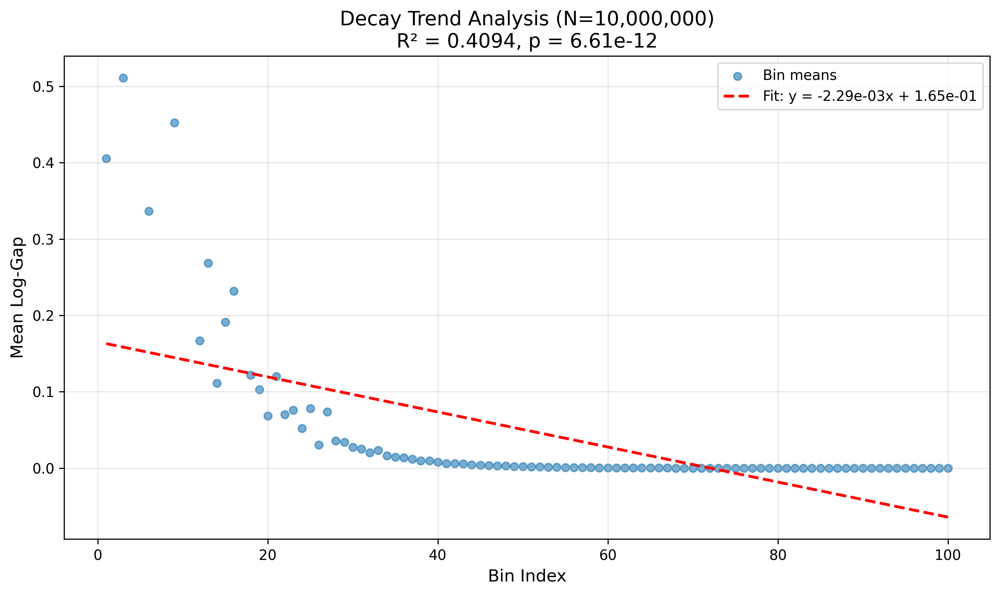

This plot shows the mean log-gap value for each of the 100 bins along the log-prime axis, with a linear regression line fitted to assess the decay hypothesis (H-MAIN-A). The x-axis represents bin indices (1-100, corresponding to increasing prime magnitudes), and the y-axis shows the mean log-gap within each bin. A negative slope indicates that log-gaps decrease as primes get larger, supporting the hypothesis that prime gaps become relatively smaller with scale. The regression statistics (slope, R², p-value) are displayed in the legend, providing quantitative evidence for the trend.

### 2. Log-Gap Histogram (log_gap_histogram.png)
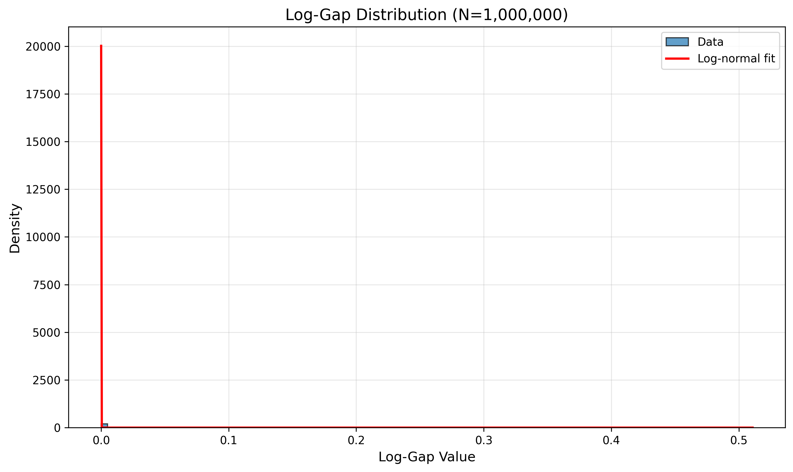

A histogram of all log-gap values across the dataset, binned into 100 equal-width intervals on the log-gap scale. The x-axis represents log-gap values, and the y-axis shows frequency. This plot illustrates the overall distribution shape of log-gaps, typically right-skewed. The red overlay shows a fitted log-normal distribution for comparison, helping evaluate the goodness of fit for hypothesis H-MAIN-B. Vertical lines indicate key percentiles (e.g., median, 95th percentile) to highlight distribution characteristics.

### 3. Q-Q Plot vs Log-Normal (qq_plot_lognormal.png)
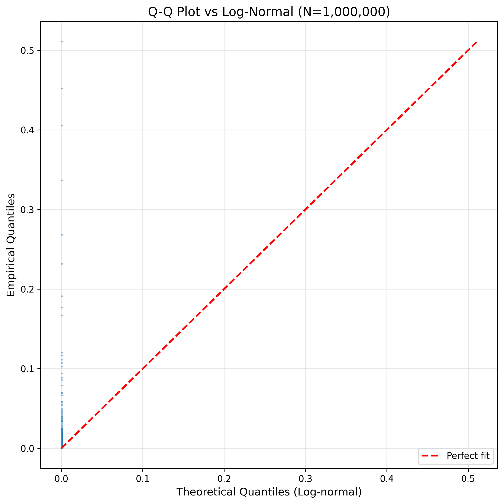

A quantile-quantile plot comparing the empirical distribution of log-gaps to a theoretical log-normal distribution. Points falling along the 45-degree reference line indicate good fit. Deviations suggest the distribution differs from log-normal (e.g., heavier tails or skewness). This plot provides a visual assessment of hypothesis H-MAIN-B, with statistical tests (Kolmogorov-Smirnov, Anderson-Darling) reported in the title or legend. Outliers are highlighted to identify regions where the fit is poor.

### 4. Autocorrelation Function (ACF) (acf.png)

The autocorrelation function for log-gaps, showing correlations at lags 1-50. The x-axis represents lag (in terms of gap indices), and the y-axis shows autocorrelation coefficient (-1 to 1). Blue bars indicate significant correlations (outside the 95% confidence band, shaded gray). This plot tests hypothesis H-MAIN-C for short-range memory. The dashed lines mark the significance threshold; bars above/below indicate potential autocorrelation. Ljung-Box test results are displayed if computed.

### 5. Partial Autocorrelation Function (PACF) (pacf.png)
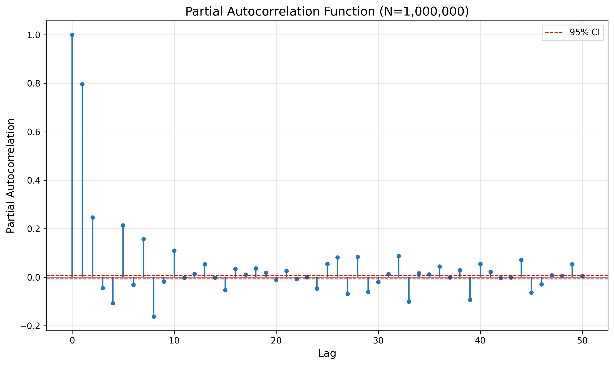

Similar to ACF but shows partial autocorrelations, controlling for intermediate lags. This helps identify the direct correlation at each lag, useful for detecting AR (autoregressive) patterns. Significant spikes indicate potential memory effects. The plot complements ACF in evaluating temporal dependencies in log-gaps, supporting falsification of H-MAIN-C if significant autocorrelations are absent.

### 6. Log-Prime vs Log-Gap Scatter (log_prime_vs_log_gap.png)
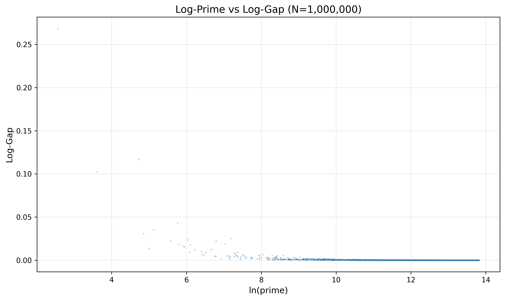

A scatter plot of log(prime) on the x-axis versus log-gap on the y-axis for all data points. Each point represents a prime and its subsequent gap. A colored density overlay (heatmap) shows data concentration. This plot visualizes the relationship between prime magnitude and gap size, with a potential downward trend supporting the decay hypothesis. Outliers (large gaps) are visible as points far from the main cluster.

### 7. Box Plot per Bin (box_plot_per_bin.png)
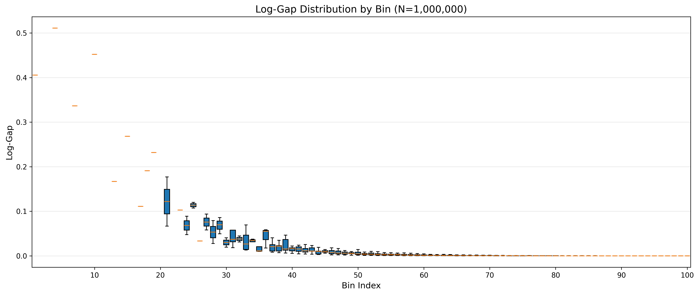

Box-and-whisker plots for log-gaps within each of the 100 bins. Each box shows median (line), quartiles (box edges), and whiskers (1.5*IQR). Outliers are marked as points. The x-axis represents bin indices, y-axis log-gap values. This plot reveals within-bin variability and skewness across scales. Consistent downward median trends support decay, while increasing spread might indicate changing gap distributions.

### 8. Cumulative Distribution Function (CDF) (cdf.png)
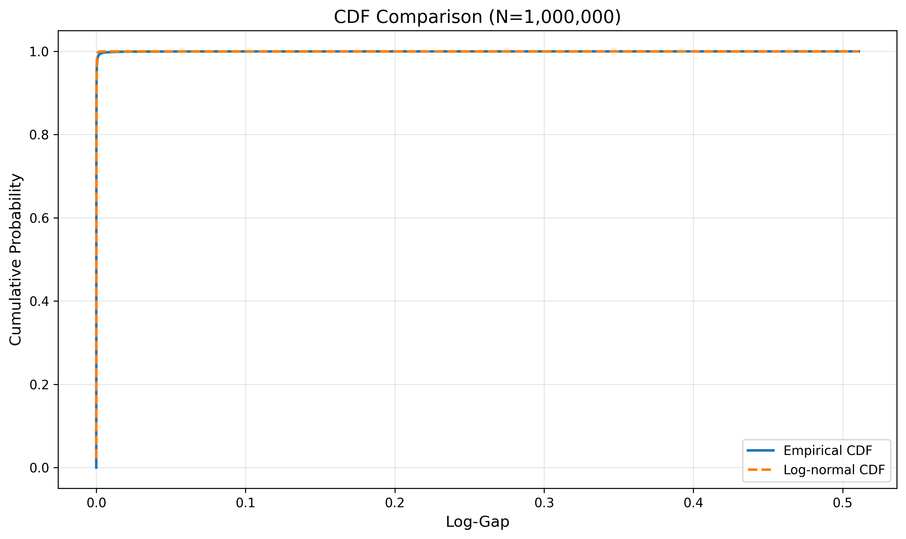

Empirical CDF of log-gaps (blue) overlaid with the theoretical log-normal CDF (red). The x-axis is log-gap values, y-axis cumulative probability (0-1). Vertical lines mark key quantiles. This plot quantifies the fit to log-normal distribution (H-MAIN-B), with deviations indicating misfit regions. The Kolmogorov-Smirnov statistic measures maximum deviation, displayed in the legend.

### 9. Kernel Density Estimate (KDE) (kde.png)
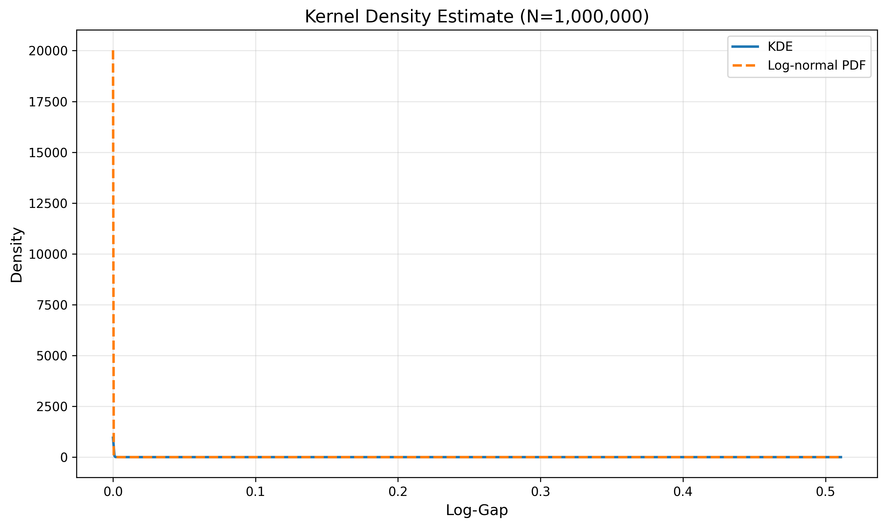

Smoothed density estimate of log-gap distribution using kernel density estimation (blue), with log-normal fit overlaid (red). The x-axis is log-gap, y-axis density. This provides a continuous view of the histogram, highlighting modes, skewness, and tails. Bandwidth selection affects smoothness; the plot helps assess distribution shape for hypothesis testing.

### 10. Regression Residuals (regression_residuals.png)
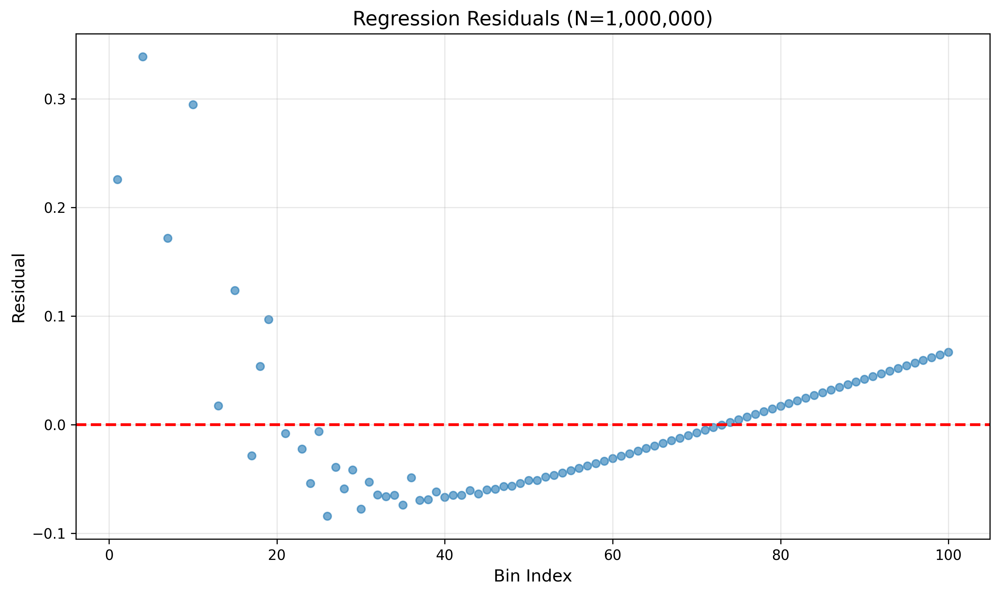

Residuals from the linear regression of mean log-gap vs bin index. X-axis: bin indices, y-axis: residuals (observed - predicted). A horizontal line at zero indicates perfect fit. Patterns (e.g., curvature) suggest model inadequacy. Random scatter supports linearity assumption. This plot validates the regression analysis for H-MAIN-A.

### 11. Log-Gap vs Regular Gap Scatter (log_gap_vs_regular_gap.png)
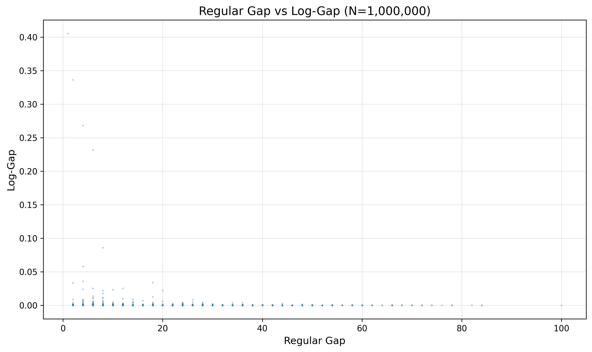

Scatter plot of regular gap (x-axis) vs log-gap (y-axis). Colored by prime index or magnitude. This illustrates the relationship between absolute and logarithmic gap measures, showing how log-gaps stabilize variance across scales. Dense clusters indicate typical behavior, while outliers highlight extreme gaps.

### 12. Prime Density (prime_density.png)
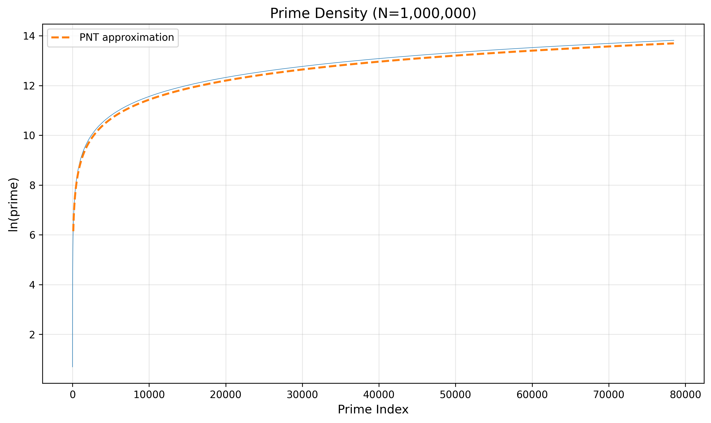

Prime index (x-axis) vs log(prime) (y-axis). Each point is a prime at its sequential position. The plot shows the density of primes along the number line, with the characteristic logarithmic growth. Slope approximates 1/ln(x) per prime number theorem. This provides context for gap analysis, showing how primes are distributed.

## 3D Plots

### 1. 3D Scatter Plot (scatter_3d.png)
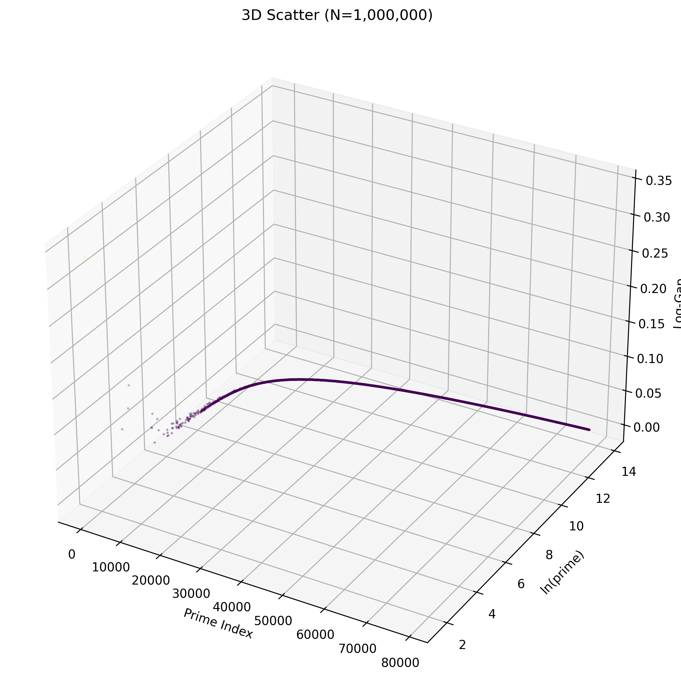

A 3D scatter plot with axes: index (x), log-prime (y), log-gap (z). Sampled to 10,000 points for performance. Rotation allows viewing from multiple angles. This visualizes the three-way relationship, showing how gaps change with both position and magnitude. Color coding by log-gap value enhances interpretation.

### 2. 3D Surface Plot (surface_3d.png)
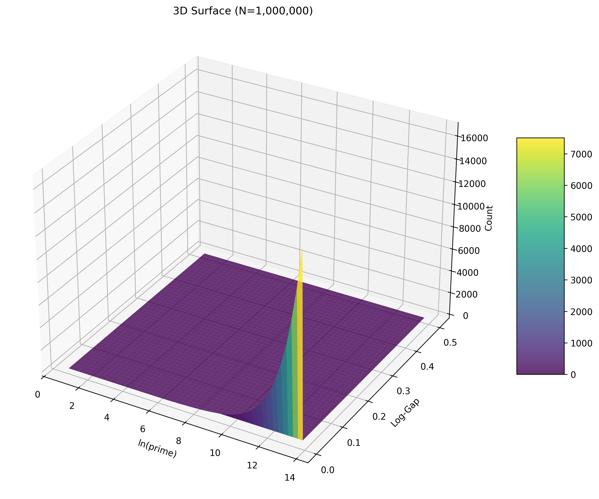

2D histogram surface of log-prime (x) vs log-gap (y), with frequency as height (z). Binned into 50x50 grid. This shows the joint distribution density, revealing patterns in gap-magnitude relationships. Peaks indicate common combinations, valleys rare ones. Supports exploration of distributional changes across scales.

### 3. 3D Contour Plot (contour_3d.png)
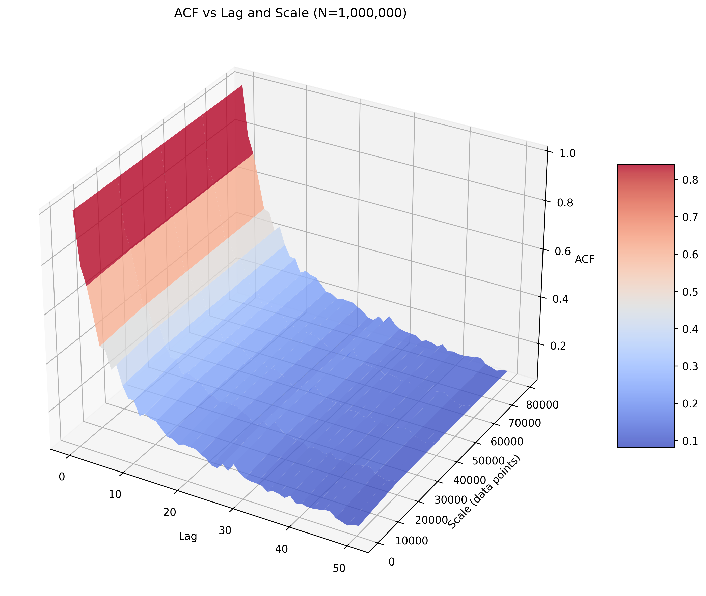

Contour lines of autocorrelation as a function of lag (x) and scale (log-prime bins, y). Height represents ACF value. This 3D view shows how autocorrelation varies with prime magnitude, helping detect scale-dependent memory effects. Multiple scales are overlaid for comparison.

### 4. 3D Wireframe Plot (wireframe_3d.png)
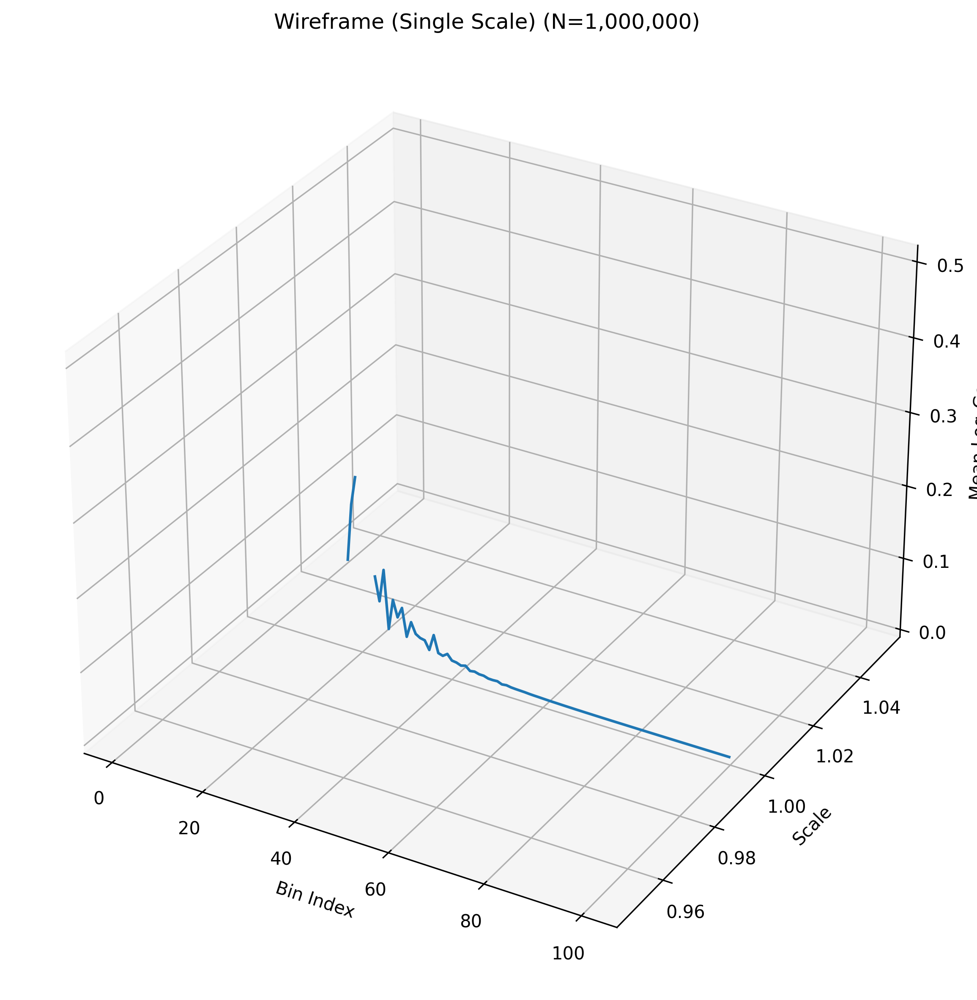

Wireframe surface of mean log-gap per bin (z) across bin index (x) and some secondary variable (y, e.g., bin variance). This extends the decay trend into 3D, showing multi-dimensional relationships. Useful for visualizing how decay interacts with other bin statistics.

### 5. 3D Bar Plot (bar_3d.png)
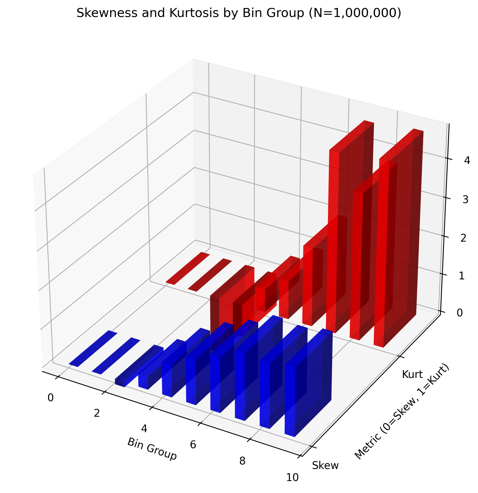

3D bars showing skewness (height) and kurtosis (color/depth) across 10 grouped bins. X-axis: bin groups, y-axis: statistic type, z-axis: value. This highlights distributional shape changes across scales, supporting falsification of H-MAIN-C if patterns emerge.

## Notes
- Plots are generated only when `--plots` flag is used.
- All plots use high DPI (300) for publication quality.
- Plots are saved in scale-specific subfolders (e.g., `results/10^5/` for max_prime=10^5).
- Inline images reference local paths; adjust for actual subfolder.
- For large scales (>10^7), plots may be skipped automatically to avoid performance issues.