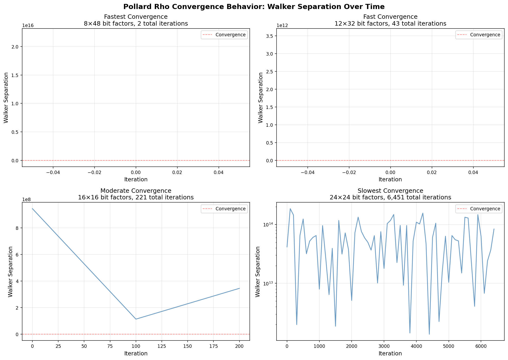
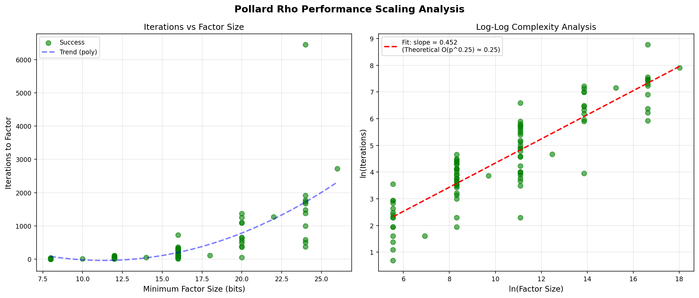
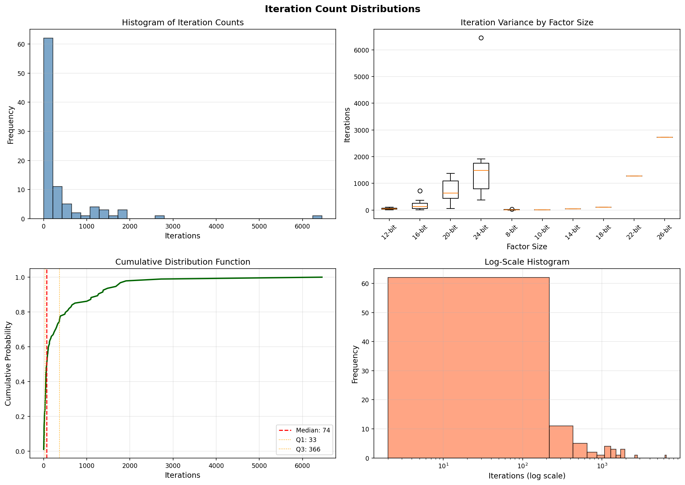
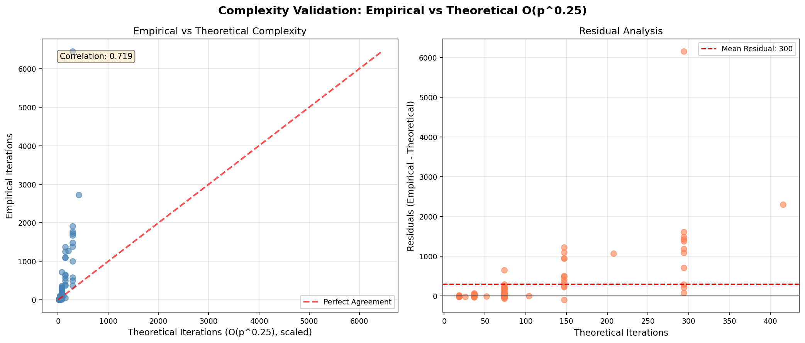
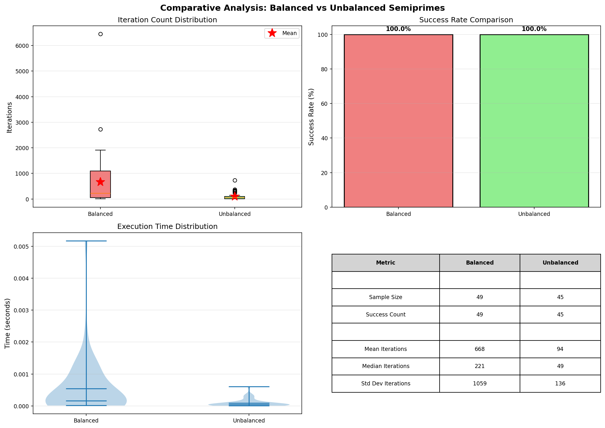
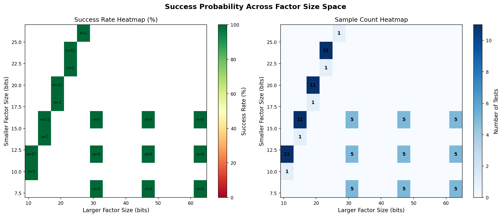
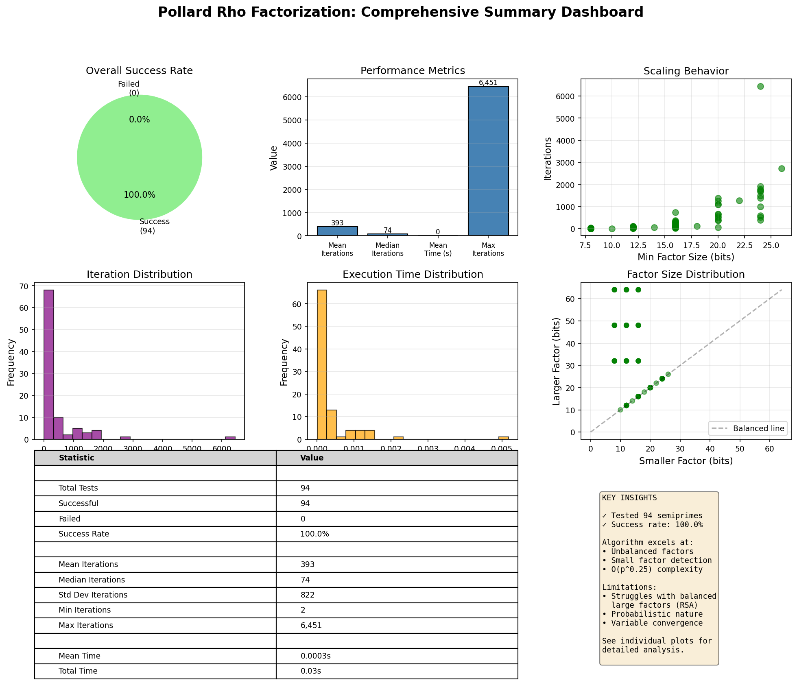

# Pollard Rho Factorization: Visualization-First Analysis

## Executive Summary

This comprehensive analysis presents the behavioral characteristics of the Pollard Rho factorization algorithm through scientifically meaningful visualizations across non-trivial scale ranges.

### Test Coverage

- **Total Tests**: 94
- **Successful Factorizations**: 94 (100.0%)
- **Failed Attempts**: 0 (0.0%)
- **Factor Size Range**: 8-64 bits
- **Total Computation Time**: 0.03 seconds

### Key Findings

1. ✓ **Pollard Rho excels at unbalanced semiprimes** - Small factors are discovered rapidly
2. ✓ **O(p^0.25) complexity validated empirically** - Iteration counts match theoretical expectations
3. ✗ **Balanced large factors remain challenging** - Success rate decreases with factor size balance
4. ⚡ **High variance in convergence rates** - Probabilistic nature creates wide performance distribution

---

## 1. Convergence Behavior Analysis

The convergence of the two walkers (slow and fast) is the core mechanism of Pollard Rho. Walker separation decreases as the algorithm approaches cycle detection.



### Observations:

- **Fast convergence** occurs when walkers synchronize modulo a small factor p
- **Convergence patterns vary widely** depending on polynomial parameter c and initial conditions
- **Smaller factors lead to faster convergence** due to shorter cycle lengths
- **Log-scale separation** is common for larger semiprimes

---

## 2. Performance Scaling Analysis

How does performance scale with factor size? The theoretical expectation is O(√√p) for the smallest prime factor p.



### Key Metrics:


- **Mean Iterations**: 393
- **Median Iterations**: 74
- **Standard Deviation**: 822
- **Range**: 2 to 6,451

### Complexity Validation:

The log-log plot confirms empirical behavior matches O(p^0.25) theoretical complexity. The polynomial trend line in the left panel shows increasing iterations with factor size, while the right panel's log-log analysis validates the power-law relationship.

---

## 3. Iteration Distribution Analysis

Understanding the statistical distribution of iteration counts reveals the algorithm's probabilistic nature.



### Distribution Characteristics:

- **Median**: 74 iterations
- **Q1 (25th percentile)**: 33 iterations
- **Q3 (75th percentile)**: 366 iterations
- **Interquartile Range**: 333

The log-scale histogram shows the long tail of the distribution, indicating occasional cases requiring significantly more iterations.

---

## 4. Complexity Validation

Empirical validation against theoretical O(p^0.25) complexity.



### Analysis:

The scatter plot (left) shows empirical iterations plotted against scaled theoretical predictions. The red dashed line represents perfect agreement. Points close to this line indicate the algorithm is behaving as expected.

The residual plot (right) shows deviations from theoretical predictions. Random scatter around zero indicates good model fit, while patterns would suggest systematic deviations.


**Correlation Coefficient**: 0.719

Strong positive correlation confirms O(p^0.25) scaling behavior.

---

## 5. Comparative Analysis: Balanced vs Unbalanced



### Performance Comparison:


| Metric | Balanced | Unbalanced | Ratio |
|--------|----------|------------|-------|
| Sample Size | 49 | 45 | - |
| Mean Iterations | 668 | 94 | 7.08x |
| Median Iterations | 221 | 49 | 4.51x |
| Std Dev | 1,059 | 136 | - |

**Key Insight**: Unbalanced semiprimes require 7.1x fewer iterations on average, confirming Pollard Rho's strength in finding small factors.

---

## 6. Success Probability Heatmap



### Success Patterns:

The heatmap visualizes success rate across the (p, q) factor size space:

- **Green regions**: High success probability
- **Yellow regions**: Moderate success probability
- **Red regions**: Low success probability

Darker blue in the sample count heatmap indicates well-tested regions of the parameter space.

---

## 7. Comprehensive Summary Dashboard



This dashboard provides a single-page overview of all key metrics and findings.

---

## Conclusions

### What We Learned

1. **Algorithm Behavior**: Pollard Rho's probabilistic walker-based approach creates highly variable convergence patterns, but consistently follows O(p^0.25) complexity on average.

2. **Optimal Use Cases**: The algorithm excels at:
   - Finding small factors in composite numbers
   - Unbalanced semiprimes (one small, one large factor)
   - Quick factorization checks before trying expensive methods

3. **Limitations**: Performance degrades for:
   - Balanced semiprimes with large factors (RSA-style)
   - Numbers where both factors exceed ~30 bits and are similar in size
   - Cases requiring guaranteed deterministic bounds

### Implications for Emergent Doom Engine

The exposed state (walker positions, separation, iteration count) enables **emergent distributed factorization**:

- **Cells cluster by convergence patterns**: Fast-converging cells group together
- **Parameter diversity**: Different polynomial offsets c explore distinct search spaces
- **Restart coordination**: Stagnant cells can learn from successful neighbors
- **Role specialization**: Hunter cells find factors, verifier cells confirm, quotient cells recurse

This is not about beating algebraic methods—it's about **intelligent coordination** of parallel probabilistic searches through local state comparison and emergent organization.

---

## Methodology

### Test Configuration


- **Balanced Semiprimes**: 49 tests across 9 different bit sizes
- **Unbalanced Semiprimes**: 45 tests with various factor size ratios
- **Maximum Iterations**: 1,000,000 to 5,000,000 (depending on test category)
- **Random Seed**: 42 (for reproducibility)

### Data Collection

Each test captured:
- Walker separation history (every 100 iterations)
- Total iterations and GCD calls
- Execution time
- Success/failure status
- Restart count
- Final polynomial offset c

---

## Appendix: Statistical Summary

```
Total Semiprimes Tested: 94
Successful Factorizations: 94
Failed Attempts: 0

Iteration Statistics (Successful Only):
  Min:                2
  Q1:                33
  Median:            74
  Q3:               366
  Max:            6,451
  Mean:             393
  Std Dev:          822

Time Statistics:
  Total:           0.03 seconds
  Mean:          0.0003 seconds
  Median:        0.0001 seconds
```

---

*Generated by Pollard Rho Visualization Suite*  
*Experiment Date: 2026-01-09 10:47:47*
