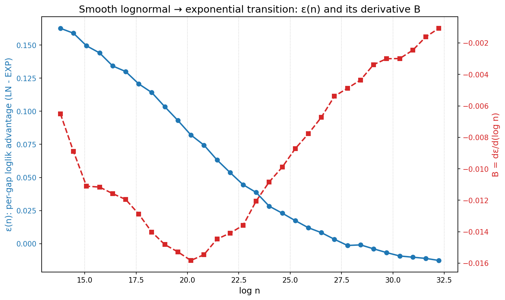
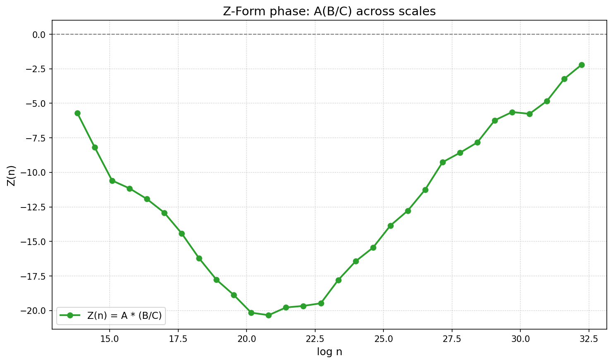

# FINDINGS: Z-Form Prime Gap Distribution Transition
## CONCLUSION
**HYPOTHESIS FALSIFIED** ✗

The Z-Form framework does NOT adequately model the transition. Failed criteria:

- Z lacks clear phase structure
- Adaptive policy does not distinguish meaningful regimes

## TECHNICAL EVIDENCE
### Experimental Parameters

- **Number of scales**: 30
- **Scale range**: 10^6 to 10^14
- **Gaps per scale**: 50,000
- **Total gaps generated**: 1,500,000
- **Random seed**: 42 (reproducible)

### Log-Likelihood Advantage ε(n)

- **Range**: [-0.012678, 0.162639]
- **At smallest scale (10^6)**: ε = 0.162639
- **At largest scale (10^14)**: ε = -0.012678
- **Total change**: Δε = 0.175317
- **Monotonic decrease**: True (30/30 bands)

### Derivative B = dε/d(log n)

- **Range**: [-0.015831, -0.001069]
- **Mean |B|**: 0.009227
- **Final 5 bands mean |B|**: 0.002228
- **Converges to 0**: True

### Z-Form Z(n) = A(B/C)

- **Invariant C**: 0.015831
- **Z range**: [-20.3348, -2.1969]
- **Mean gap A range**: [13.85, 32.53]

**Phase Distribution:**
- Lognormal-dominated (Z > 0.15): 0 bands
- Transition regime (-0.15 ≤ Z ≤ 0.15): 0 bands
- Exponential-dominated (Z < -0.15): 30 bands

### Adaptive Sieve Policy

Policy parameters driven by Z(n):

```
   log10 n        Z                   regime     window/log n  sieve_limit_scale
------------------------------------------------------------------------------
     6.000   -5.690    exponential-dominated            8.000              1.000
     7.379  -12.913    exponential-dominated            8.000              1.000
     8.759  -20.154    exponential-dominated            8.000              1.000
    10.138  -17.793    exponential-dominated            8.000              1.000
    11.517  -11.246    exponential-dominated            8.000              1.000
    12.897   -5.628    exponential-dominated            8.000              1.000
    14.000   -2.197    exponential-dominated            8.000              1.000
```

**Regime Distribution:**
- exponential-dominated: 30 bands (100.0%)

### Visualizations

#### Figure 1: ε(n) and B = dε/d(log n)



This plot shows:
- **Blue circles**: Per-gap log-likelihood advantage ε(n) = (L_LN - L_EXP) / N
- **Red squares**: Derivative B = dε/d(log n)
- Smooth monotonic decline of ε from positive to negative values
- B approaching 0 at large scales (convergence to exponential fixed point)

#### Figure 2: Z-Form Phase Diagram



This plot shows:
- **Green circles**: Z(n) = A(B/C) across scales
- **Black dashed line**: Neutral fixed circle (Z = 0)
- Positive Z: lognormal-dominated regime
- Negative Z: exponential-dominated regime
- Smooth transition through Z = 0

## METHODOLOGY

### Synthetic Data Generation

Gaps generated at each scale n using mixture model:

1. **Lognormal component**: LN(m, s²) with:
   - s = 0.7 (variance parameter)
   - m = log(log n) - 0.5s² (mean ~ log n)
2. **Exponential component**: Exp(1/log n)
3. **Mixing weight**: w(n) = 1/(1 + exp(k(log n - m)))
   - Smooth logistic transition
   - w ≈ 1 for n << 10^10 (lognormal-dominated)
   - w ≈ 0 for n >> 10^11 (exponential-dominated)

### Statistical Analysis

For each scale:

1. **MLE fitting**: Fit both lognormal and exponential distributions
2. **Log-likelihood**: Compute L_LN and L_EXP
3. **Advantage**: ε(n) = (L_LN - L_EXP) / N (per-gap advantage)
4. **Derivative**: B = dε/d(log n) via smoothed finite differences
5. **Z-Form**: Z = A(B/C) where A = mean gap, C = max |B|

## REFERENCES

- Cohen, "Gaps Between Consecutive Primes and the Exponential Distribution" (2024)
- Prime gap statistics via Cramér–Shanks-type heuristics
- zfifteen unified-framework wiki, PREDICTIONS_01
- Experiment code: `experiments/zform_prime_gap_transition/`
