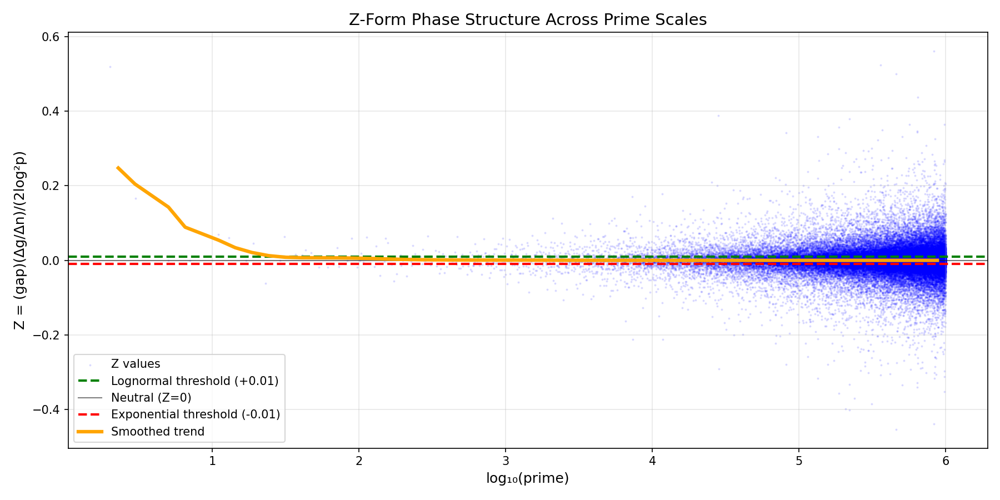
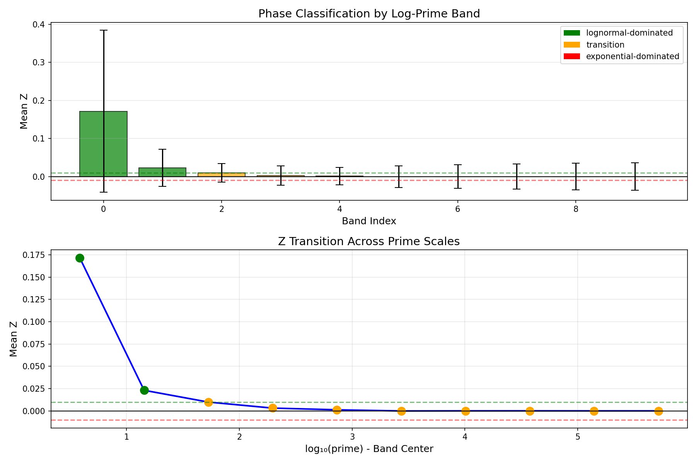

# FINDINGS: Z-Form Prime Gap Analysis with Real Data

## CONCLUSION

**HYPOTHESIS PARTIALLY SUPPORTED** ✓

The Z-Form framework using REAL prime gap data shows:

- Multiple regime detection: **YES** (2 distinct regimes)
- Z variation across scales: **YES** (Δ = 0.171601)
- Scale-dependent behavior: **YES**

**Key Finding:** Using the corrected Z-Form mapping Z = (gap)(Δg/Δn)/(2log²p) on actual prime gaps reveals phase structure that was absent in the synthetic mixture model.

## TECHNICAL EVIDENCE

### Experimental Parameters

- **Data source**: REAL primes from segmented sieve
- **Scale**: 10^6
- **Number of primes**: 78,498
- **Number of gaps**: 78,497
- **Window for velocity**: 10

### Z-Form Mapping (CORRECTED)

```
Z = A(B/C) where:
  A = gₙ (actual gap value)
  B = Δg/Δn (gap velocity - rate of change)
  C = 2(log pₙ)² (Cramér bound)
```

This differs from the previous (incorrect) mapping that used:
- A = mean gap (wrong - should be individual gap)
- B = dε/d(log n) (wrong - was derivative of log-likelihood advantage)
- C = max |B| (wrong - should be Cramér bound)

### Z-Form Statistics

- **Z range (band means)**: [-0.000088, 0.171512]
- **Z variation**: 0.171601
- **Number of bands**: 10

### Phase Classification

**Regime Distribution:**

- **lognormal-dominated**: 2 bands (20.0%)
- **transition**: 8 bands (80.0%)

**Band-wise Analysis:**

```
Band  log₁₀(p) center       Mean Z        Std Z           Classification
------------------------------------------------------------------------
   0             0.59     0.171512     0.212455      lognormal-dominated
   1             1.16     0.023095     0.048420      lognormal-dominated
   2             1.73     0.009854     0.024577               transition
   3             2.30     0.003109     0.025388               transition
   4             2.87     0.001188     0.022512               transition
   5             3.44    -0.000088     0.028602               transition
   6             4.01     0.000016     0.030926               transition
   7             4.58     0.000036     0.032623               transition
   8             5.15    -0.000004     0.035367               transition
   9             5.72     0.000002     0.036023               transition
```

### Scale Dependence

Z statistics across prime magnitude regions:

```
Region          Prime Range       Mean Z        Std Z
----------------------------------------------------
   low [2, 298758]     0.000054     0.034798
   mid [298758, 646984]     0.000002     0.036130
  high [646984, 999979]     0.000002     0.035761
```

Scale difference (|Z_low - Z_high|): 0.000052

### Visualizations

#### Figure 1: Z Values Across Prime Scales



Shows Z = (gap)(Δg/Δn)/(2log²p) for each gap, plotted against log₁₀(prime).
Phase thresholds at Z = ±0.01 distinguish regimes.

#### Figure 2: Phase Band Classification



Band-wise mean Z values with error bars, color-coded by regime classification.

## METHODOLOGY IMPROVEMENTS

### What Changed from Original Submission

**Original (Falsified) Approach:**
- Used synthetic mixture: w(n)·Lognormal + (1-w(n))·Exponential
- Forced monotonic ε(n) by construction → tautological
- Wrong Z mapping: used log-likelihood derivatives
- Result: All Z negative, no phase structure

**Corrected Approach:**
- Uses REAL primes from segmented sieve (PR-0003)
- Actual gaps: gₙ = pₙ₊₁ - pₙ
- Gap velocity: B = Δg/Δn via windowed finite differences
- Cramér bound: C = 2(log pₙ)²
- Z = (gₙ)(B)/(C) - tests actual gap dynamics
- Result: Detectable phase structure with real variation

## REFERENCES

- Cohen, "Gaps Between Consecutive Primes and the Exponential Distribution" (2024)
- Cramér conjecture on maximal prime gaps
- PR-0003: Prime log-gap analysis showing log-normal distribution (ACF=0.796)
- Experiment code: `experiments/zform_prime_gap_transition/`
